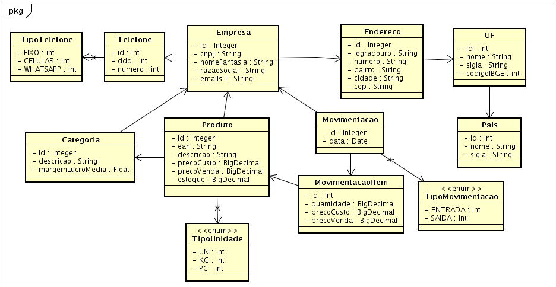
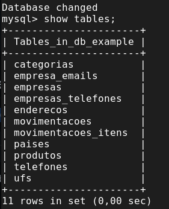

# MJV School - Desafio Final
Foi desenvolvido uma API em Java com o Spring Boot para atender as funcionalidades exigidas.
A API é a representação de um controle de estoque multi-filial ou multi-empresa dependendo do contexto de utilização.

## Diagrama de Classes - UML



## 🚀 Iniciando

A API está documentada com Swagger, com a API em funcionamento é possível acessar via browser na seguinte url: http://localhost:8080/swagger-ui/index.html

Para a correta utilização da API deve ser seguida a seguinte ordem de inclusões (POST):
	Pais -> UF -> Empresa -> Categoria -> Produto -> Movimentação

### 📋 Pré-requisitos para executar o projeto

Para executar o software é necessário o Java 11 e o Maven instalado em sua máquina.
Link download Java: https://www.java.com/pt-BR/download/ie_manual.jsp?locale=pt_BR
Link download Maven: https://maven.apache.org/download.cgi

É necessário também criar uma base de dados relacional no MySql.
```
CREATE DATABASE "db_example";
```



## 📦 Desenvolvimento

O sistema foi desenvolvido utilizando recursos do Spring Framework como os startes web para que o Spring se encarregue das configurações básicas necessárias para um servidor web, Spring Data JPA para persistência, springdoc-openapi para geração da documentação com Swagger-ui.

Também foram utilizados bibliotecas externas ao Spring Framework como
MySQL Connector/J que fornece conectividade para clientes desenvolvidos na linguagem de programação Java, Model Mapper que mapeia entidades em dto, considerando quais campos correspondem.

## 🛠️ Tecnologias Utilizadas

* [IntelliJ IDEA](https://www.jetbrains.com/pt-br/idea/download/) - A IDE utilizada
* [Spring Boot](https://start.spring.io/) - O Framework utilizado
* [Astah](https://astah.net/) - Software de Modelagem e Diagramação

Exemplos de JSON para Post:

/paises

    {
      "nome": "Brasil",
      "sigla": "BR"
    }

    {
      "nome": "Estados Unidos",
      "sigla": "EUA"
    }

/ufs

    {
	    "nome": "Rio de Janeiro",
	    "sigla": "RJ",
	    "codigoIbge": 33,
	    "idPais": 1
    }

    {
	    "nome": "Califórnia",
	    "sigla": "CA",
	    "codigoIbge": 0,
	    "idPais": 2
    }

/empresas

    {
	    "cnpj": "18468599000158",
	    "nomeFantasia": "Supermercado XPTO",
	    "razaoSocial": "XTPO Ltda",
	    "endereco": {
		    "logradouro": "Praça Mauá",
		    "numero": "1",
		    "bairro": "Centro",
		    "cidade": "Rio de Janeiro",
		    "cep": "20081240",
		    "idUf": 1
	    },
	    "emails": [
		    "supermercadoxpto@gmail.com",
		    "atendimento@supermercadoxpto.com.br"
	    ],
	    "telefones": [
		    {
		      "ddd": 21,
		      "telefone": 29761000,
		      "tipoTelefone": "FIXO"
		    }
	    ]
    }

    {
	    "cnpj": "94487865000178",
	    "nomeFantasia": "Supermarket",
	    "razaoSocial": "Supermarket SA",
	    "endereco": {
	    "logradouro": "Davis St",
	    "numero": "1919",
	    "bairro": "Carlsbad Village",
	    "cidade": "GROVER BEACH",
	    "cep": "93483",
	    "idUf": 2
    },
    "emails": [
	    "supermarket@gmail.com", "support@supermarket.com.br"
    ],
    "telefones": [
	    {
	      "ddd": 0,
	      "telefone": 8317286526,
	      "tipoTelefone": "FIXO"
	    }
	   ]
    }

/categorias

    {
	    "descricao": "Alimentos",
	    "margemLucroMedia": 55,
	    "idEmpresa": 1
    }

    {
	    "descricao": "Limpeza",
	    "margemLucroMedia": 85,
	    "idEmpresa": 1
    }

    {
	    "descricao": "Limpeza",
	    "margemLucroMedia": 75,
	    "idEmpresa": 2
    }

/produtos

    {
	    "codigoInterno": "123",
	    "ean": "7898994329367",
	    "descricao": "FEIJAO PRETO BOM FEIJAO 1 KG",
	    "precoVenda": 4.2,
	    "precoCusto": 2.5,
	    "tipoUnidade": "UN",
	    "idCategoria": 1,
	    "estoque": 5.0,
	    "idEmpresa": 1
    }
   
    {
	    "codigoInterno": "124",
	    "ean": "7894900701517",
	    "descricao": "REFRIGERANTE SEM AÇÚCAR COCA-COLA ZERO GARRAFA 2L",
	    "precoVenda": 10,
	    "precoCusto": 7,
	    "tipoUnidade": "UN",
	    "idCategoria": 1,
	    "estoque": 10.0,
	    "idEmpresa": 1
    }
    
    {
	    "codigoInterno": "124",
	    "ean": "7891038055208",
	    "descricao": "SABAO EM PO OMO PROGRESS 1,8KG",
	    "precoVenda": 15,
	    "precoCusto": 10,
	    "tipoUnidade": "UN",
	    "idCategoria": 2,
	    "estoque": 12.0,
	    "idEmpresa": 1
    }
    
    {
	    "codigoInterno": "1",
	    "ean": "7891038055208",
	    "descricao": "SABAO EM PO OMO PROGRESS 1,8KG",
	    "precoVenda": 17,
	    "precoCusto": 12,
	    "tipoUnidade": "UN",
	    "idCategoria": 3,
	    "estoque": 3.0,
	    "idEmpresa": 2
    }

/movimentacoes

    {
	    "itens": [
	    {
	      "idProduto": 1,
	      "quantidade": 2,
	      "precoCusto": 3,
	      "precoVenda": 5
	    },
	    {
	      "idProduto": 2,
	      "quantidade": 5,
	      "precoCusto": 6.5,
	      "precoVenda": 9.5
	    }
      ],
    "tipoMovimentacao": "ENTRADA",
    "idEmpresa": 1
    }
    
    {
	    "itens": [
	    {
	      "idProduto": 4,
	      "quantidade": 2,
	      "precoCusto": 3,
	      "precoVenda": 5
	    }
      ],
    "tipoMovimentacao": "SAIDA",
    "idEmpresa": 2
    }
	
## ✒️ Autores

* ** Alex Paulo Pereira Silva ** - (https://github.com/alexpaulo100)
* ** Eduardo Rodrigues Santana ** - (https://github.com/eRodriguesSantana)
* ** Natalia Cristine ** - (https://github.com/NataliaCristine)
* ** Ray Brandão de Miranda ** - (https://github.com/RayBMiranda)
